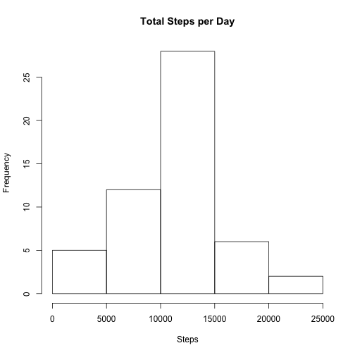
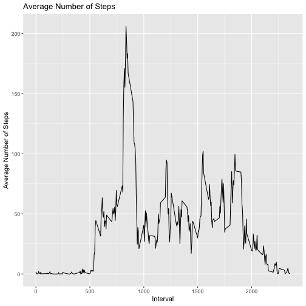
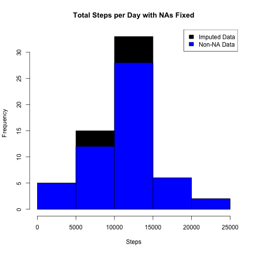
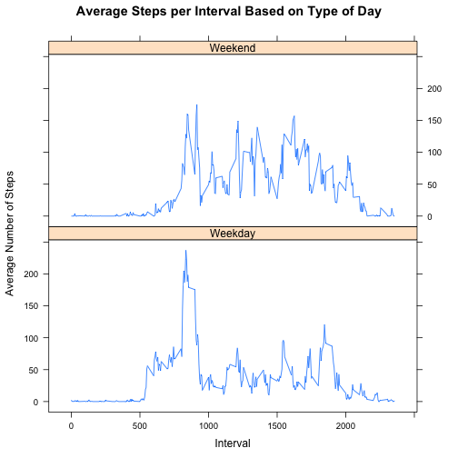

title: "Reproducable Research Project 1"
author: "Jacob Steenhuysen"
date: "9/29/2018"
output: html_document
========================================

This first chuck of code will grab the data and load the data.

```r
library(ggplot2)
library(plyr)
activity <- read.csv("activity.csv")
```

This next chunk of code is going to process the data.

```r
activity$day <- weekdays(as.Date(activity$date))
activity$DateTime <- as.POSIXct(activity$date, format="%Y-%m-%d")
```

So what is the total number of steps walked everyday? 

```r
sumTable <- aggregate(activity$steps ~ activity$date, FUN=sum, )
colnames(sumTable) <- c("Date", "Steps")
```

This is a historgram of the total number of steps.

```r
hist(sumTable$Steps, breaks=5, xlab="Steps", main = "Total Steps per Day")
```



Next we will calculate and report the mean and median number of steps taken everydat.

```r
as.integer(mean(sumTable$Steps))
```

```
## [1] 10766
```

This will find the median.

```r
as.integer(median(sumTable$Steps))
```

```
## [1] 10765
```
So what is the average daily activity pattern?

Well, we need to make a time series plot (i.e. type = “l”) of the 5-minute interval (x-axis) and the average number of steps taken, averaged across all days (y-axis).


```r
library(plyr)
library(ggplot2)

#This gets the data.
clean <- activity[!is.na(activity$steps),]

#This finds the average number of steps.
intervalTable <- ddply(clean, .(interval), summarize, Avg = mean(steps))

#This will create a line plot of the number of steps.
p <- ggplot(intervalTable, aes(x=interval, y=Avg), xlab = "Interval", ylab="Average Number of Steps Taken")
p + geom_line()+xlab("Interval")+ylab("Average Number of Steps")+ggtitle("Average Number of Steps")
```



So which 5-minute interval--on average across all the days in the dataset--contains the maximum number of steps?


```r
maxSteps <- max(intervalTable$Avg)

intervalTable[intervalTable$Avg==maxSteps,1]
```

```
## [1] 835
```
So the maximum number of steps for a 5 minute period was 206 steps and the 5 minute period that had the most steps was the 835 period. 

Imputing missing values!
We need to calculate the number of total missing values.

```r
nrow(activity[is.na(activity$steps),])
```

```
## [1] 2304
```
The total number of rows with steps = ‘NA’ is 2304.

Next we need to fingure out how to subsitute the missing steps with the average 5 minute interval based on the day of the week. 

```r
#This will create the average number of steps per weekday and time period. 
avgTable <- ddply(clean, .(interval, day), summarize, Avg = mean(steps))
#This will create a dataset with all NAs.
nadata<- activity[is.na(activity$steps),]
#This will merge NA data with average weekday tme periods.
newdata<-merge(nadata, avgTable, by=c("interval", "day"))
```
So now we will create a new dataset that is equal to the original dataset but with the missing data filled in.

```r
#This will record the new sub data.
newdata2<- newdata[,c(6,4,1,2,5)]
colnames(newdata2)<- c("steps", "date", "interval", "day", "DateTime")

#This is merge the NA averages and nonNA data. 
mergeData <- rbind(clean, newdata2)
```

We need to make a histogram of the total number of steps taken each day and calculate and report the mean and median total number of steps taken per day. 

Do these values differ from the estimates from the first part of the assignment? 
What is the impact of imputing missing data on the estimates of the total daily number of steps?

```r
sumTable2 <- aggregate(mergeData$steps ~ mergeData$date, FUN=sum, )
colnames(sumTable2)<- c("Date", "Steps")

as.integer(mean(sumTable2$Steps))
```

```
## [1] 10821
```

```r
#This will find the median number of steps with NA.
as.integer(median(sumTable2$Steps))
```

```
## [1] 11015
```

Finally, we will create a historgram.

```r
hist(sumTable2$Steps, breaks=5, xlab="Steps", main = "Total Steps per Day with NAs Fixed", col="Black")
hist(sumTable$Steps, breaks=5, xlab="Steps", main = "Total Steps per Day with NAs Fixed", col="Blue", add=T)
legend("topright", c("Imputed Data", "Non-NA Data"), fill=c("black", "blue") )
```



The new mean of the imputed data is 10821 steps. This is different when compared to the old mean of 10766 steps. That creates a difference of 55 steps on average per day.

The new median of the imputed data is 11015 steps. So when you compared that to the old median of 10765 steps. That creates a difference of 250 steps for the median.

Are there differences in activity patterns between weekdays and weekends?
We need to create a new factor variable in the dataset with two levels - “weekday” and “weekend” indicating whether a given date is a weekday or weekend day.

```r
#This will create a new category. 
mergeData$DayCategory <- ifelse(mergeData$day %in% c("Saturday", "Sunday"), "Weekend", "Weekday")
```

Then we need to make a panel plot containing a time series plot of the 5-minute time periods (x-axis) and the average number of steps taken, averaged across all weekday days or weekend days (y-axis).

```r
library(lattice)
```
Now we need to plot the data.

```r
intervalTable2 <- ddply(mergeData, .(interval, DayCategory), summarize, Avg = mean(steps))

xyplot(Avg~interval|DayCategory, data=intervalTable2, type="l",  layout = c(1,2),
       main="Average Steps per Interval Based on Type of Day", 
       ylab="Average Number of Steps", xlab="Interval")
```


So yes. As you can see, the step activity trends are different based on whether the day occurs on a weekend or not.
